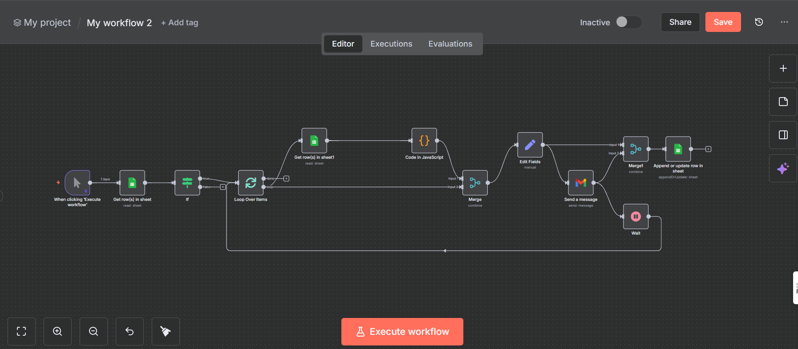

# 🤖 AI-Powered Automatic Email Agent

This project automates **sending personalized job application emails and resumes** to recruiters using **n8n**, **Google Sheets**, and **Gmail**.

---

## 📌 Overview

- Fetches recruiter data from Google Sheets  
- Applies custom JavaScript logic to personalize email content  
- Sends emails via Gmail automatically  
- Updates application status back to Google Sheets  
- Reduces manual effort and improves recruiter outreach efficiency

---

## 🧩 Tech Stack

- **n8n** — workflow automation  
- **JavaScript** — logic inside Code nodes  
- **Google Sheets** — data storage & status tracking  
- **Gmail API** — email delivery

---

## 🖼 Workflow Screenshot

---

## 🚀 How It Works

1. Start the workflow manually in n8n  
2. Read recruiter details from Google Sheets  
3. Personalize message content using JavaScript  
4. Send emails automatically through Gmail  
5. Update the application status in Google Sheets

---

